<div align="center">

<!-- ░░░ HEADER — venom type creates organic liquid blob edge (very rare) ░░░ -->


<!-- ░░░ GROUNDBREAKING TRICK: Stack 4 typing SVGs to simulate a live IDE terminal ░░░ -->
<!-- Each SVG is a "line" of the terminal, creating a frame-by-frame coding illusion -->


<br/>

<!-- ░░░ ANIMATED STATUS BADGE ROW ░░░ -->


<br/><br/>

[](https://github.com/krishnasahoo11156)
&nbsp;·&nbsp;

&nbsp;·&nbsp;
[](https://github.com/krishnasahoo11156/DSA)

<br/>

> ### *✨ "The journey of a thousand lines begins with a single `public static void main`." ✨*

</div>

---

## 🌊 Live Journey Ticker

<div align="center">


</div>

---

## 🗺️ Roadmap — Visual Flowchart

```mermaid
flowchart LR
    classDef done    fill:#00d4ff,color:#000,stroke:#00d4ff,font-weight:bold
    classDef active  fill:#FFD700,color:#000,stroke:#FFD700,font-weight:bold
    classDef next    fill:#ff6b35,color:#fff,stroke:#ff6b35
    classDef todo    fill:#1a1a2e,color:#888,stroke:#333

    A["✅ 01\nFlow of\nProgram"]:::done   -->  B["🔄 02\nFirst\nJava"]:::active
    B                                    -->  C["⏭️ 03\nConditionals\n& Loops"]:::next
    C --> D["04\nFunctions"]:::todo
    D --> E["05\nArrays"]:::todo
    E --> F["06\nSearching"]:::todo
    F --> G["07\nSorting"]:::todo
    G --> H["08\nStrings"]:::todo
    H --> I["09\nPatterns"]:::todo
    I --> J["10\nRecursion"]:::todo
    J --> K["11\nBitwise"]:::todo
    K --> L["12\nMath"]:::todo
    L --> M["13\nComplexity"]:::todo
    M --> N["14\nOOP"]:::todo
    N --> O["15\nLinked List"]:::todo
    O --> P["16\nStack & Queue"]:::todo
    P --> Q["17\nTrees"]:::todo
    Q --> R["⛰️ 18\nHeaps"]:::todo
```



---

## 📋 Module Progress Tracker

<div align="center">

| # | Module | Topic | Status | Files |
|:---:|:-------|:------|:------:|:-----:|
| `01` | `flow-of-program` | 🌊 Flow of Program | ✅ **Done** | 5 |
| `02` | `first-java` | ☕ First Java | 🔄 **In Progress** | 6 |
| `03` | `conditionals-loops` | 🔁 Conditionals & Loops | ⏭️ **Next Up** | — |
| `04` | `functions` | ⚙️ Functions | ⬜ Not Started | — |
| `05` | `arrays` | 📦 Arrays | ⬜ Not Started | — |
| `06` | `searching` | 🔍 Searching | ⬜ Not Started | — |
| `07` | `sorting` | 🔃 Sorting | ⬜ Not Started | — |
| `08` | `strings` | 🔤 Strings | ⬜ Not Started | — |
| `09` | `patterns` | 🔷 Patterns | ⬜ Not Started | — |
| `10` | `recursion` | 🌀 Recursion | ⬜ Not Started | — |
| `11` | `bitwise` | 💡 Bitwise Ops | ⬜ Not Started | — |
| `12` | `math` | ➗ Math | ⬜ Not Started | — |
| `13` | `complexities` | 📈 Complexities | ⬜ Not Started | — |
| `14` | `oop` | 🏛️ OOP | ⬜ Not Started | — |
| `15` | `linkedlist` | 🔗 Linked List | ⬜ Not Started | — |
| `16` | `stack-queue` | 🗂️ Stack & Queue | ⬜ Not Started | — |
| `17` | `trees` | 🌳 Trees | ⬜ Not Started | — |
| `18` | `heaps` | ⛰️ Heaps | ⬜ Not Started | — |

**Legend:** &nbsp; ✅ Done &nbsp;|&nbsp; 🔄 In Progress &nbsp;|&nbsp; ⏭️ Next Up &nbsp;|&nbsp; ⬜ Not Started

</div>

---

## 📁 Repository Structure

```text
📦 DSA/
│
├── 📄 README.md
│
├── 📂 first-java/                     ← 📍 Module 02 — ACTIVE 🔄
│   ├── ☕ Calculator.java             # Arithmetic: + − × ÷  via if-else
│   ├── ☕ CurrencyConverter.java      # INR → USD  (÷ 88 exchange rate)
│   ├── ☕ EvenOdd.java                # Even / Odd check  (num % 2)
│   ├── ☕ Greeting.java               # Personalised welcome greeting
│   ├── ☕ LargestNumber.java          # Largest of 2 numbers  (if-else)
│   └── ☕ SimpleInterest.java         # SI = (P × R × T) / 100
│
├── 📂 flow-of-program/                ← ✅ Module 01 — COMPLETE
│   ├── ☕ HCFandLCM.java              # GCD & LCM calculator
│   ├── ☕ LeapYear.java               # Leap year validator
│   ├── ☕ Table.java                  # Multiplication table generator
│   ├── ☕ Sum.java                    # Accumulate until 'x' is typed
│   └── ☕ Scrapfile.java              # Logic playground / scratch pad
│
└── 📂 upcoming/
    ├── conditionals-loops/            ← Module 03 ⏭️
    ├── functions/                     ← Module 04
    ├── arrays/                        ← Module 05
    └── ...                            ← Modules 06–18
```

---

## 🔍 Module 02 — First Java: Deep Dive

<div align="center">

<!-- Simulated terminal prompt typing different program names -->


</div>

<br/>

<details>
<summary><b>🧮 Calculator.java — Two numbers + operator → Result</b></summary>
<br/>

> **Concept:** `if / else-if` chain &nbsp;|&nbsp; **Input:** `int, int, char`

```java
char op = sc.next().charAt(0);

if      (op == '+') System.out.println("Sum: "      + (a + b));
else if (op == '-') System.out.println("Difference: "+ (b - a));
else if (op == '*') System.out.println("Product: "  + (a * b));
else if (op == '/') System.out.println("Quotient: " + (a / b));
else                System.out.println("Invalid operator!");
```

```
Enter the first number  : 12
Enter the second number : 4
Enter the operation     : *
The product of 12 and 4 is : 48
```

</details>

<details>
<summary><b>💱 CurrencyConverter.java — INR → USD</b></summary>
<br/>

> **Concept:** Integer arithmetic &nbsp;|&nbsp; **Rate:** 1 USD = 88 INR

```java
int usd = (rupees / 88);
System.out.print("The conversion of " + rupees + " rupees in usd is : " + usd);
```

```
Enter the amount in rupees : 50000
The conversion of 50000 rupees in usd is : 568
```

</details>

<details>
<summary><b>🔢 EvenOdd.java — Is it Even or Odd?</b></summary>
<br/>

> **Concept:** Modulus operator `%`

```java
if (num % 2 == 0) System.out.println(num + " is Even");
else              System.out.println(num + " is Odd");
```

```
Enter a number: 7
7 is Odd
```

</details>

<details>
<summary><b>👋 Greeting.java — Hello, World... personalised!</b></summary>
<br/>

> **Concept:** `String` input, `Scanner`

```java
System.out.println("Hello " + name + " Welcome to my DSA journey");
```

```
Enter your name: Krishna
Hello Krishna Welcome to my DSA journey
```

</details>

<details>
<summary><b>🏆 LargestNumber.java — Who wins: a or b?</b></summary>
<br/>

> **Concept:** Comparison with `if-else`

```java
if (a > b) System.out.println("Largest number is : " + a);
else       System.out.println("Largest number is : " + b);
```

```
Enter the first number  : 42
Enter the second number : 17
Largest number is : 42
```

</details>

<details>
<summary><b>📐 SimpleInterest.java — Finance meets Java</b></summary>
<br/>

> **Concept:** Arithmetic formula &nbsp;|&nbsp; `SI = (P × R × T) / 100`

```java
float interest = (principle * rate * time) / 100;
System.out.println("The simple interest is : " + interest);
```

```
Enter the principle amount : 10000
Enter the rate of interest : 5
Enter the time             : 3
The simple interest is     : 1500.0
```

</details>

---

## 🚀 Getting Started

### ✅ Prerequisites

| Tool | Minimum | Recommended |
|:-----|:-------:|:-----------:|
| ☕ JDK | 17+ | **25+** |
| 🖥️ IDE | Any | **VS Code + Java Extension Pack** |
| 🐙 Git | Any | Latest |

### ⚡ Clone & Run in 3 Commands

```bash
# 1️⃣  Clone
git clone https://github.com/krishnasahoo11156/DSA.git && cd DSA

# 2️⃣  Compile
javac first-java/CurrencyConverter.java

# 3️⃣  Run
java -cp first-java CurrencyConverter
```

> 💡 **VS Code users:** Hit the **▶ Run** button — the Extension Pack handles everything automatically!

---

## 📊 Stats Dashboard

<div align="center">

| 📦 Total Modules | ✅ Completed | 🔄 In Progress | ☕ Java Files |
|:---:|:---:|:---:|:---:|
| **18** | **1** | **1** | **11** |

<br/>

<!-- GitHub Stats — reliable Vercel deployment -->
<a href="https://github.com/krishnasahoo11156">
  
</a>
&nbsp;
<a href="https://github.com/krishnasahoo11156">
  
</a>

<br/><br/>

<!-- Streak stats — herokuapp is more stable than demolab -->
<a href="https://github.com/krishnasahoo11156">
  
</a>

</div>

---

## 🛠️ Tech Stack

<div align="center">

<!-- Skillicons — extremely reliable CDN -->


<br/><br/>


</div>

---

## 🎯 Learning Phases — The Full Blueprint

```
╔═══════════════════════════════════════════════════════════════════╗
║  PHASE 1 ✅→🔄   Foundations   │  Flow · Syntax · Types · I/O   ║
║  PHASE 2 ⏭️        Logic        │  Conditions · Loops · Methods  ║
║  PHASE 3 ⬜        Core DSA     │  Arrays · Search · Sort · Str  ║
║  PHASE 4 ⬜        Advanced     │  Recursion · Bitwise · Math    ║
║  PHASE 5 ⬜        OOP          │  Classes · Inheritance · DS    ║
║  PHASE 6 ⬜        Trees&Heaps  │  BST · AVL · Heaps · PQ       ║
╚═══════════════════════════════════════════════════════════════════╝
```

---

## 👨‍💻 Author

<div align="center">


<br/>

[](https://github.com/krishnasahoo11156)

<br/>

*If this repo helped you even a little — drop a* ⭐ *— it genuinely means the world! 🌍*

</div>

---

<div align="center">

<!-- Footer venom wave — matching header style -->


**Made with ❤️ and lots of ☕ · Krishna Sahoo · 2025**

*"Every expert was once a beginner. The only difference? They kept going." 🚀*

</div>
